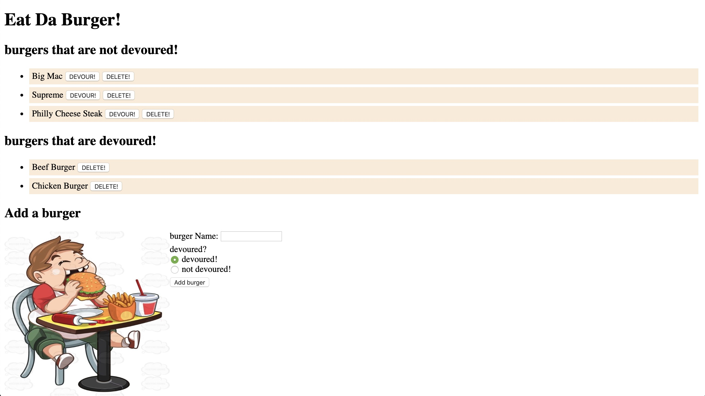

# burger-MySQL-Express-Handlebars

## Heroku Deployed Link

* https://burger-bailing.herokuapp.com/

## Main View

* 

## App description

* This application is for the management of burger restaurants, which supports Create/Read/Update/Delete (CRUD) burgers. Meanwhile, there is a one-way update setting (the devoured burgers cannot be returned to not devoured).

* About docking databases, the app is connected to the mysql database, and mock data can be added in advance, or can be updated in real time through this app.

## Languages/technologies/frameworks used

* Node.js
* Express
* MYSQL
* Handlebars
* JavaScript
* jQuery
* JSON
* Ajax
* CSS
